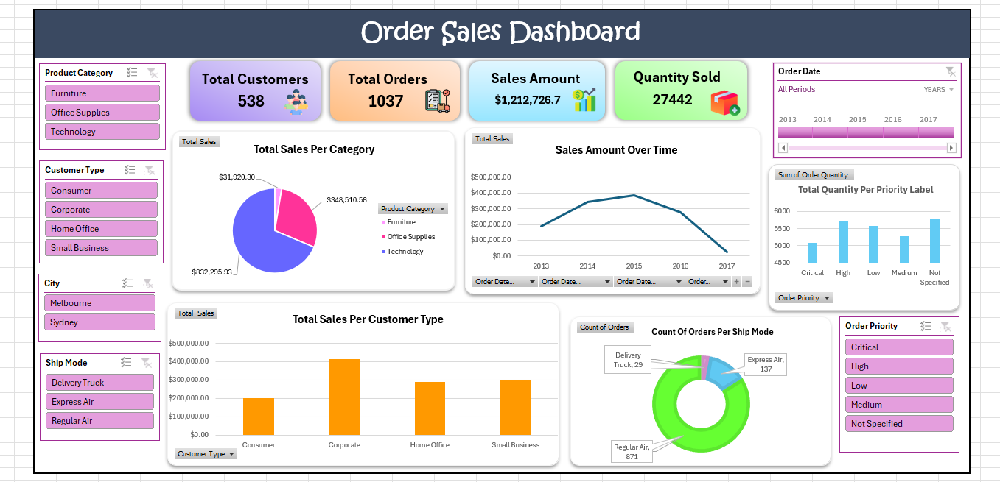

# Order Sales Excel Dashboard 📊

## About the Project

This project features an interactive Excel Dashboard designed to analyze and visualize order sales data across different dimensions such as product categories, customer types, shipping modes, cities, and order priorities.

- **Data Source:** Stored in two sheets inside `Excel - Lab 2.xlsx`. These sheets contain raw data for orders and customer details.
- **Data Cleaning:**
  - Removed duplicates
  - Handled missing or incorrect values
  - Reformatted columns for consistency
  - Prepared tables for Pivot Table creation
- **Tools Used:** Excel Pivot Tables, Pivot Charts, Slicers (Filters), and Dashboard formatting
---

## Dashboard Insights

✅ **KPIs**
- Total Customers: 538
- Total Orders: 1037
- Total Sales Amount: $1,212,726.70
- Total Quantity Sold: 27,442

✅ **Interactive Features**
- Slicers for filtering by:
  - Product Category
  - Customer Type
  - City
  - Ship Mode
  - Order Priority
  - Order Date (Timeline)
- Pivot Charts update dynamically based on selected filters

✅ **Charts and Visuals**
- Pie chart: Total Sales per Product Category
- Line chart: Sales Amount Over Time
- Bar chart: Total Sales Per Customer Type
- Doughnut chart: Count of Orders Per Ship Mode
- Bar chart: Total Quantity Per Order Priority

## Files in Repository

- `Excel - Lab 2.xlsx` → Excel file containing the original raw data in two sheets
- `Dashboard-Lab2.xlsx` → Excel file containing the cleaned data, pivot tables, and dashboard
- `/Image/Dashboard.png` → Screenshot of the dashboard

